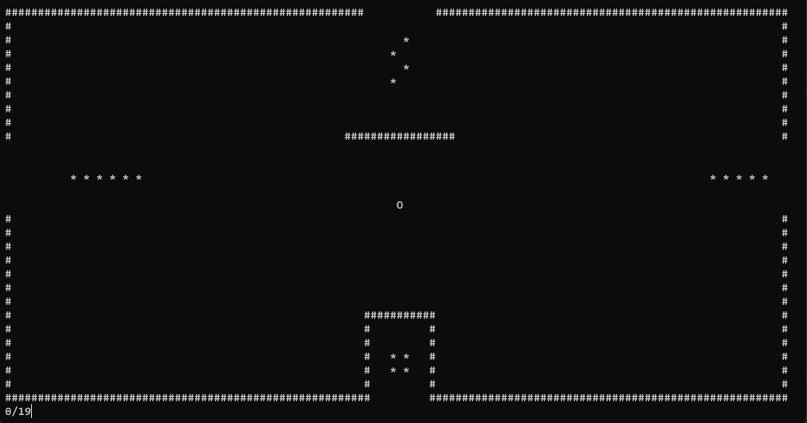

# PACMAN Parte 1
### *Creado por Daniel Puado y Christian Brun*

 

 
<!-- TABLA DE CONTENIDOS -->

  
Tabla De Contenidos

  <ol>
    <li>
      <a href="#sobre-el-proyecto">Sobre El Proyecto</a>
    </li>
    <li>
      <a href="#controles">Controles</a>
    </li>
    <li>
      <a href="#compatibilidad">Compatibilidad</a>
    </li>
    <li>
      <a href="#roadmap">Roadmap</a>
    </li>
    <li><a href="#participantes-del-proyecto">Participantes Del Proyecto</a></li>
  </ol>

 

<!-- SOBRE EL PROYECTO -->
## Sobre El Proyecto

**Se trata de una replica del clasico juego PACMAN creado en consola a traves del lenguaje C++.**

>El objectivo es recolectar todas las monedas del mapa para ganar

(<a href="#readme-top">Volver Arriba</a>)

<!-- CONTROLES -->
## Controles

##### Controles del juego:
- **W** = Moverse arriba
- **S** = Moverse abajo
- **A** = Moverse hacia la izquierda
- **D** = Moverse hacia la derecha
- **Q** = Salir del juego

(<a href="#readme-top">Volver Arriba</a>)

<!-- COMPATIBILIDAD -->
## Compatibilidad

**Proyecto hecho con:**

[![Cplusplus][Cplusplus.com]][Cplusplus-url]

| Sistema Operativo | Soporte |
|-------------------|---------|
| Windows           |   SI    |
| MacOS             |   NO    |
| Linux             |   NO    |

(<a href="#readme-top">Volver Arriba</a>)

<!-- ROADMAP -->
## Roadmap

### GitHub
- [x] Gitflow
- [x] Pull Request
- [x] Etiqueta y Release
- [x] Formato del Readme
### Desarollo
- [x] Dibujado del mapa en consola
- [x] Movimiento del jugador
- [x] Recoleccion de monedas
- [x] Sistema de teletransporte
- [x] Contador de puntos
- [x] Monstrar pantalla final cuando se gana
- [x] Funcion para salir del juego
- [x] Enter automatico
- [x] Comentarios de codigo usando la etiqueta "summary"
- [ ] Cambiar los colores a los distintos objectos del mapa
- [ ] Soporte Multi Idioma
    - [x] Español
    - [ ] Ingles

(<a href="#readme-top">Volver Arriba</a>)

<!-- PARTICIPANTS -->
## Participantes del Proyecto

- Daniel Puado San Segundo ([Aqueldelacueva](https://github.com/aqueldelacueva) y www (por error de configuración de visual studio 2022)
- Christian Andreas Brun ([ChristianAndreasBrun](https://github.com/ChristianAndreasBrun))

Link del Proyecto: [https://github.com/aqueldelacueva/PacMan-P1-Andreas-Daniel](https://github.com/aqueldelacueva/PacMan-P1-Andreas-Daniel)

(<a href="#readme-top">Volver Arriba</a>)

<!-- MARKDOWN LINKS & IMAGES -->
[Cplusplus.com]: https://img.shields.io/badge/C%20PLUSPLUS-004488?style=for-the-badge&logo=cplusplus&logoColor=white
[Cplusplus-url]: https://cplusplus.com/
